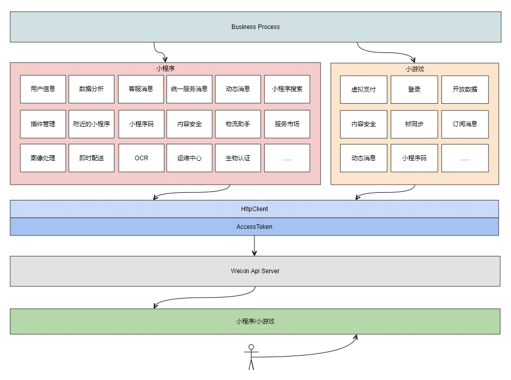

# fastwego/miniprogram

A fast wechat miniprogram/minigame development framework written in Golang

## 快速开始 & demo

```shell script
go get github.com/fastwego/miniprogram
```

```go
// 创建小程序/小游戏实例
app := miniprogram.New(miniprogram.Config{
    Appid:  "APPID",
    Secret: "SECRET",
})

var payload = []byte(`{
  "begin_date" : "20170313",
  "end_date" : "20170313"
}`)

// 调用 api
resp, err := datacube.GetDailyRetain(app, payload)
fmt.Println(string(resp),err)
```


完整演示项目：

[https://github.com/fastwego/miniprogram-demo](https://github.com/fastwego/miniprogram-demo)

接口列表：

- 小程序 [doc/apilist.md](doc/apilist.md)
- 小游戏 [minigame/doc/apilist.md](minigame/doc/apilist.md)

## 架构设计



## 框架特点

### 快速

「快」作为框架设计的核心理念，体现在方方面面：

- 使用 Go 语言，开发快、编译快、部署快、运行快，轻松服务海量用户
- 丰富的[文档](https://pkg.go.dev/github.com/fastwego/miniprogram) 和 [演示代码](https://github.com/fastwego/miniprogram-demo) ，快速上手，5 分钟即可搭建一套完整的微信服务
- 独立清晰的模块划分，快速熟悉整个框架，没有意外，一切都是你期望的样子
- 甚至连框架自身的大部分代码也是自动生成的，维护更新快到超乎想象

### 符合直觉

作为第三方开发框架，尽可能贴合官方文档和设计，不引入新的概念，不给开发者添加学习负担

### 官方文档就是最好的文档

每个接口的注释都附带官方文档的链接，让你随时翻阅，省时省心

### 完备的单元测试

100% 覆盖每一个接口，让你每一次调用都信心满满

### 详细的日志

每个关键环节都为你完整记录，Debug 倍轻松，你可以自由定义日志输出，甚至可以关闭日志

### 多账号支持

一套服务支持多个账号，轻松成为第三方开发服务平台，业务节节高

### 支持服务集群

单台服务器支撑不住访问流量/想提高服务可用性？

只需 [设置 GetAccessTokenFunc 方法](https://pkg.go.dev/github.com/fastwego/miniprogram/?tab=doc#example-Miniprogram.SetGetAccessTokenHandler) ，从中控服务获取 AccessToken，即可解决多实例刷新冲突/覆盖的问题

### 活跃的开发者社区

FastWeGo 是一套完整的微信开发框架，包括公众号、开放平台、微信支付、企业微信、小程序、小游戏等微信服务，拥有庞大的开发者用户群体

你遇到的所有问题几乎都可以在社区找到解决方案


## 参与贡献

欢迎提交 pr/issue 或者 文档，一起让微信开发更快更好！

Faster we go together!